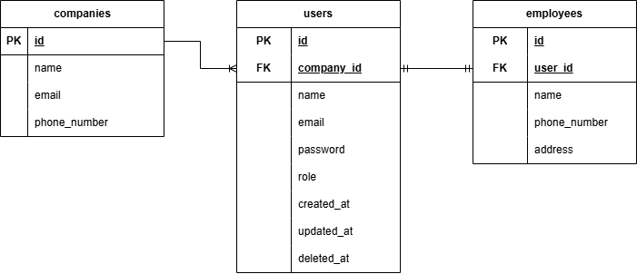

# Laravel Test - Back End Developer

## Requirements
- PHP 8.x.x
    - Ctype PHP Extension
    - cURL PHP Extension
    - DOM PHP Extension
    - Fileinfo PHP Extension
    - Filter PHP Extension
    - Hash PHP Extension
    - Mbstring PHP Extension
    - OpenSSL PHP Extension
    - PCRE PHP Extension
    - PDO PHP Extension
    - Session PHP Extension
    - Tokenizer PHP Extension
    - XML PHP Extension
- Composer 2.7.x
- MySQL
- Tymon/jwt-auth:2.1.1
- Bruno API

## Installation

- Clone project with command `git clone`
- `cd` to the root project directory
- Install depedency, run `composer install` command
- Create database with name `backend_test` then import `backend_test.sql`
- Setup Environment Variable, run `cp .env.example .env` command, then fill in database settings, generate secret key with command `php artisan jwt:secret` 
- Run `php artisan key:generate` command then run `php artisan serve` command
- Install Bruno API for Testing API. Download Bruno API [here](https://docs.usebruno.com/get-started/bruno-basics/download)
- Open Bruno API then choose `Open Collection` to the directory with name `api-docs`
- Setup enviroment to `development` then click `configure` change value for variable `API_URL` based on your application url.
- You can try the API we've created with Bruno API
- Then for unit test, you can run `php artisan test`

## Notes

**Akun Superadmin**
> Username: **khamim@gmail.com**  
> Password: **Password123!**

**Akun Manager**
> Username: **info@paketur.com**  
> Password: **Password123!**

**Akun Employee**
> Username: **hayden@gmail.com**  
> Password: **Password123!**

## Attachments
- ERD

- Unit Test Result

- 
